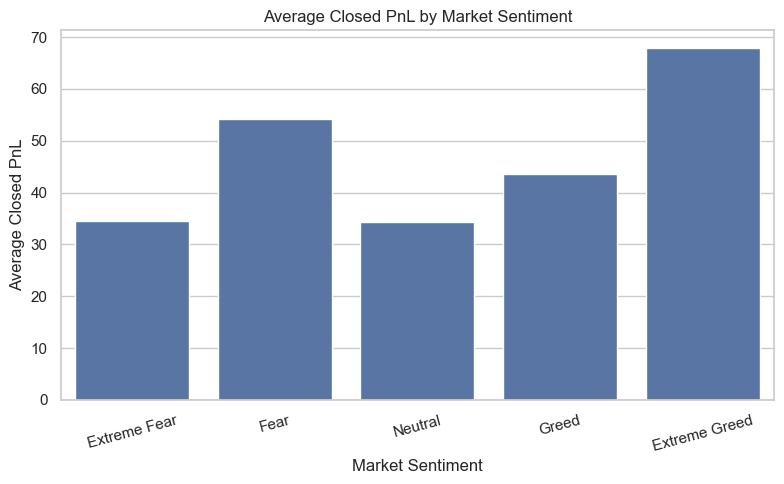
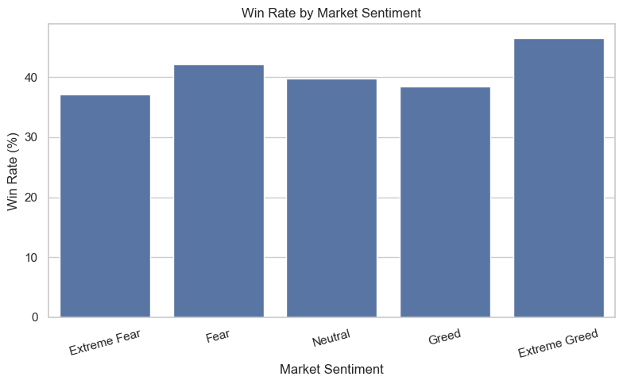
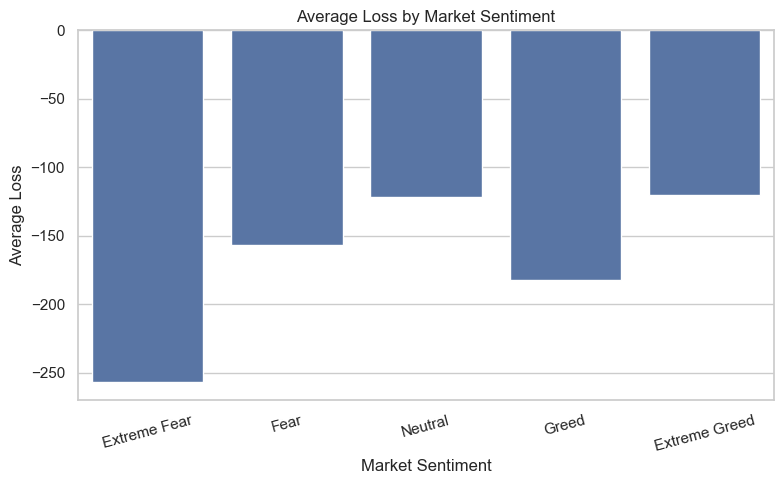
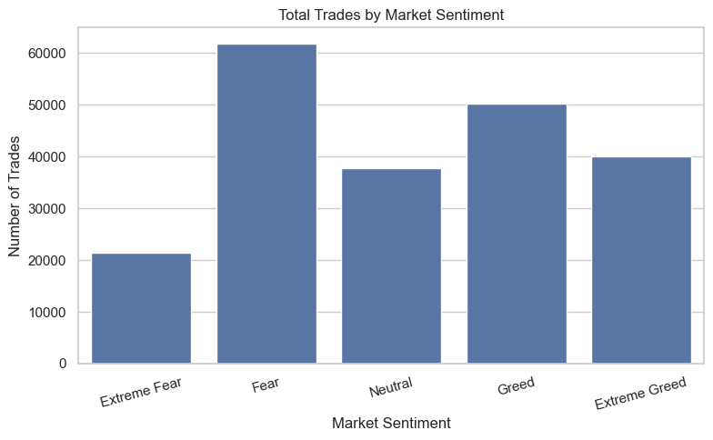
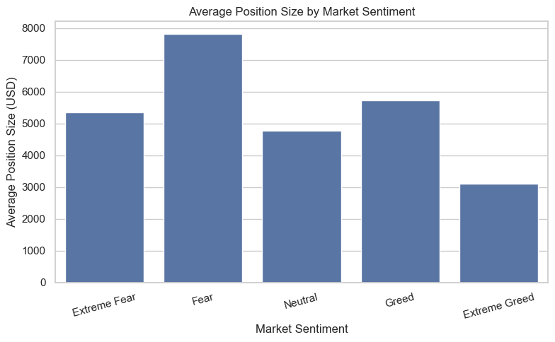
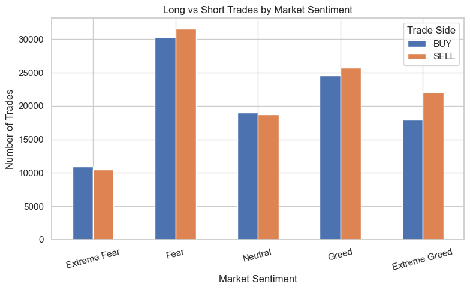
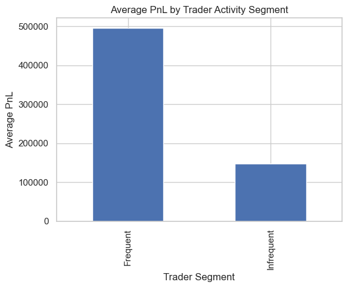
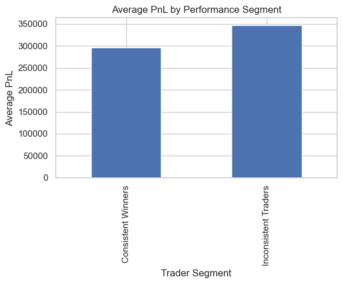

# 📈 Primetrade-Trader-Sentiment-Analysis

<p align="center">


</p>

> **Analyzing the relationship between Bitcoin market sentiment and Hyperliquid trader performance using Python.**

---

# 🚀 Project Overview

Market sentiment plays a significant role in financial markets by influencing trader behavior and decision-making. This project analyzes how different Bitcoin Fear & Greed market conditions affect the performance and trading behavior of Hyperliquid traders.

Using historical trading records and the Bitcoin Fear & Greed Index, the project investigates profitability, win rates, trading activity, position sizing, and trader segmentation to identify patterns that can support better trading decisions.

This project was completed as part of the **Primetrade.ai Data Science Intern – Round 0 Assignment**.

---

# 🎯 Business Problem

The objective of this project is to determine whether market sentiment influences trader performance and behavior.

The analysis focuses on answering the following questions:

- Does trader profitability change across different market sentiment conditions?
- Do traders behave differently during Fear and Greed markets?
- Can traders be segmented based on their trading patterns?
- What actionable strategies can be derived from the observed behavior?

---

# 📂 Dataset

Two datasets were used throughout the project.

## Raw Data

| Dataset | Description |
|----------|-------------|
| fear_greed_index.csv | Bitcoin Fear & Greed Index |
| historical_data.csv | Hyperliquid Historical Trading Data |

## Processed Data

| Dataset | Description |
|----------|-------------|
| fear_greed_index_clean.csv | Cleaned market sentiment dataset |
| historical_data_clean.csv | Cleaned trading dataset |
| trader_sentiment_model.csv | Final analytical dataset after merging both sources |

---

# 🛠️ Technology Stack

| Category | Tools |
|----------|-------|
| Programming | Python 3.14 |
| Data Analysis | Pandas, NumPy |
| Visualization | Matplotlib, Seaborn |
| Development | Jupyter Notebook |
| Version Control | Git & GitHub |

---

# 📂 Repository Structure

```text
Primetrade-Trader-Sentiment-Analysis

├── data
│   ├── raw
│   │   ├── fear_greed_index.csv
│   │   └── historical_data.csv
│   │
│   └── processed
│       ├── fear_greed_index_clean.csv
│       ├── historical_data_clean.csv
│       └── trader_sentiment_model.csv
│
├── notebooks
│   ├── 01_Data_Audit.ipynb
│   ├── 02_Data_Cleaning.ipynb
│   ├── 03_Data_Modeling.ipynb
│   └── 04_Trader_Performance_Analysis.ipynb
│
├── charts
│   ├── average_closed_pnl_by_market_sentiment.png
│   ├── win_rate_by_market_sentiment.png
│   ├── average_loss_by_market_sentiment.png
│   ├── total_trades_by_market_sentiment.png
│   ├── average_position_size_by_market_sentiment.png
│   ├── long_vs_short_trades_by_market_sentiment.png
│   ├── average_pnl_by_trader_activity_segment.png
│   └── average_pnl_by_performance_segment.png
│
├── requirements.txt
├── README.md
└── .gitignore
```

---

# 🔄 Methodology

The project follows a structured analytics workflow:

```text
Data Audit
      ↓
Data Cleaning
      ↓
Data Modeling
      ↓
Performance Analysis
      ↓
Trader Behavior Analysis
      ↓
Trader Segmentation
      ↓
Insights
      ↓
Strategy Recommendations
```

---

# 📊 Performance Analysis

Performance was evaluated across different market sentiment conditions using:

- Total Closed PnL
- Average Closed PnL
- Win Rate
- Average Loss (Drawdown Proxy)

### Average Closed PnL by Market Sentiment



### Win Rate by Market Sentiment



### Average Loss by Market Sentiment



---

# 📈 Trader Behavior Analysis

Trader behavior was analyzed using:

- Trading Frequency
- Average Position Size
- Long vs Short Trading Activity

### Total Trades by Market Sentiment



### Average Position Size by Market Sentiment



### Long vs Short Trades by Market Sentiment



---

# 👥 Trader Segmentation

Two trader segments were identified to compare trading performance.

### Frequent vs Infrequent Traders



### Consistent Winners vs Inconsistent Traders



---

# 💡 Key Insights

- Extreme Greed recorded the highest average profit per trade and the highest trader win rate.
- Fear periods experienced the highest trading activity and the largest average position sizes.
- Frequent traders generated substantially higher average profitability than infrequent traders.

---

# 🚀 Strategy Recommendations

- Maintain disciplined exposure during Extreme Greed conditions, as these periods demonstrated the strongest overall trading performance.
- Apply stricter risk management during Fear periods due to increased trading activity and larger average position sizes.

---

# ▶️ How to Run

Clone the repository:

```bash
git clone https://github.com/<your-username>/Primetrade-Trader-Sentiment-Analysis.git
```

Navigate to the project directory:

```bash
cd Primetrade-Trader-Sentiment-Analysis
```

Install the required libraries:

```bash
pip install -r requirements.txt
```

Launch Jupyter Notebook:

```bash
jupyter notebook
```

Run the notebooks in the following order:

1. `01_Data_Audit.ipynb`
2. `02_Data_Cleaning.ipynb`
3. `03_Data_Modeling.ipynb`
4. `04_Trader_Performance_Analysis.ipynb`

---

# 👨‍💻 Author

**Shivam Mahawar**

GitHub: https://github.com/shivammahawar123

---

⭐ *If you found this project useful, consider giving the repository a star.*